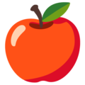

# Snake Game - Edward Drobnis
Snake is a video game that involves controlling a two-dimensional snake that moves around a playing field filled with tiles and eats apples while avoiding obstacles, with the goal of growing the snake as long as possible without crashing into walls or the snake's own body. Developed as an ISC2O final project (ISU Project).

# Table of Contents
> 1. [Usage](#Usage)
> 2. [How to Play](#How-to-Play)
> 3. [Files](#Files)

# Usage
To run the game, run `python3 main.py`. This will execute the main code file, where all the code for the snake game is found. Also, ensure that all the files are in the proper paths (more information about this can be found under [files](#Files)).

# How to Play
text

# Files
Snake Game consists of many files, including the main Python file, graphics for the snake and objects (such as the apple and trophy images), and sound. The files are listed in more detail below:

### [Main.py](./main.py)
As stated above, [main.py](./main.py) consists of the main Python code used to create the snake game. In this file, the game loads the other files from their paths (including fonts, images, and sounds), deals with events, and deals with drawing the game on the user's screen, which includes drawing the snake and apple at the appropriate position as well as displaying the proper scene on the user's screen.

### [Fonts](./Font)
The game uses [PoetsenOne-Regular](./Font/PoetsenOne-Regular.ttf) for the text in the game, which includes the user's score, "game over" text, and text on the "play" button.

### [Sounds](./Sounds)
The game contains three sound files. This includes the [crash sound](./Sounds/crash.mp3) when the snake collides with a wall or itself, the [crunch sound](./Sounds/crunch.mp3) when the snake consumes an apple, and the [move sound](./Sounds/move.mp3) when the user clicks a key to move the snake.

### [Graphics](./Graphics)
One of the major graphics in Snake Game are the images used to render the snake; however, other images include images on the main screen such as the background image, the image for the speed of the snake, and an apple that spawns randomly on the grid. These graphics are sorted below:

#### Snake 
By default, the snake is facing the right direction, but the images are rotated if necessary based on the direction the snake is heading. However, the game contains four images for each turning position instead of rotating them.

 [Head image](./Graphics/head_right.png)

 [Body image](./Graphics/body_horizontal.png)

 [Tail image](./Graphics/tail_left.png)

 [Turn image - top left](./Graphics/turn_top_left.png)

 [Turn image - top right](./Graphics/turn_top_right.png)

 [Turn image - bottom left](./Graphics/turn_bottom_left.png)

 [Turn image - bottom right](./Graphics/turn_bottom_right.png)

#### Menu
The menu screen contains a background that is drawn with 35 x 35 pixel rectangles, a background image, an apple image, a trophy image, and images for easy, hard, and random modes.

 [Background image](./Graphics/background.jpg) 

 [Apple image](./Graphics/apple.png)

 [Trophy image](./Graphics/trophy.png)

 [Easy difficulty image](./Graphics/easy_difficulty.png)

 [Hard difficulty image](./Graphics/hard_difficulty.png)

 [Random difficulty image](./Graphics/random_difficulty.png)

#### Main Game Background
The background in the main game is drawn with 35 x 35 pixel rectangles to fill the user's width and height but contains a green border around the tiles, where the snake cannot enter. On the background, the user's score is shown next to an apple image, and the user's high score is listed next to a trophy image.

 [Apple image](./Graphics/apple.png)

 [Trophy image](./Graphics/trophy.png)